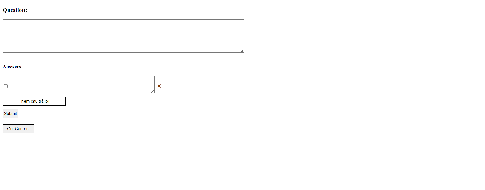
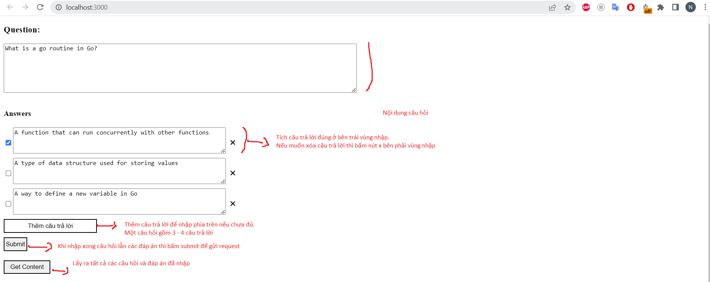

# Hướng dẫn chạy dự án
## Bước 1: Clone dự án
```
git clone https://github.com/japangermany1998/irishttp.git
```
## Bước 2: Chạy dự án
Điều kiện: đã tải golang về máy. Rồi chạy:
```
go run main.go
```
Vào đường dẫn http://localhost:3000.

Giao diện: 

## Bước 3: Nhập quiz
